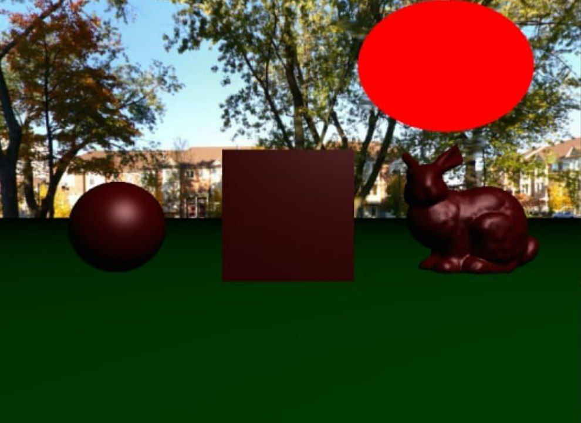
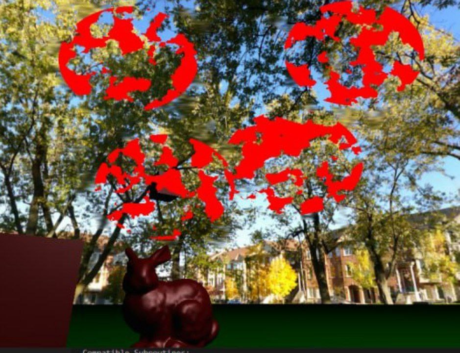
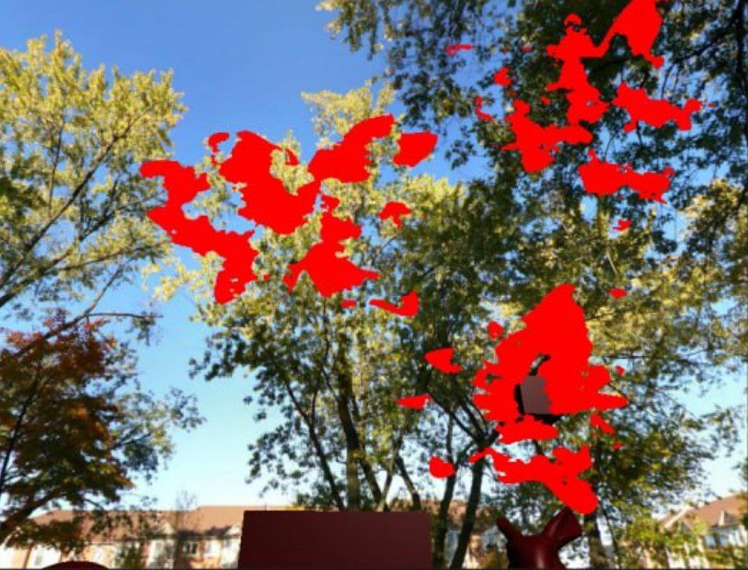
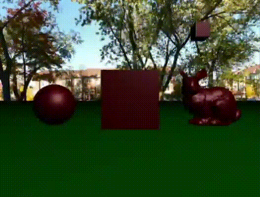

# RTGP-project
Project for the Real-time graphics programming course, the goal of the project is to create shaders that add a blur when the player gets hit by a bullet; in particular, a specific bullet might generate a blur in a random area of the FOV.  
when restoring the player’s health, the effect might reduce over time.  
To achieve this goal the project is divided into three phases. In the first one, we render the scene in the normal way, then we apply a blur to the image and in the last phase, we mix the two images.
To make everything more appetible the project is bounded by a mini-game where you have to hit the flying enemies while avoiding their shoots.
## Blur Phase
For the blur, the program offers several different options: a Gaussian blur, a mean blur, and two fake Bokeh effects, one circular and one more square.
For efficiency reasons, all the blur effects are divided into vertical and horizontal passes, using convolution masks.
### Gaussian Blur
### Mean Blur
### Fake Bokeh
To emulate the Bokeh effect I’ve used [a technique described during the 2018 GDC by EA]( https://ubm-twvideo01.s3.amazonaws.com/o1/vault/gdc2018/presentations/Garcia_Kleber_CircularDepthOf.pdf) which use a separable complex filter to produce a circle of confusion.
These filters could be combined using multiple components to achieve a better result but for this project, I’ve used only one component with a radius of 15 pixels.  
#### Circular Fake Bokeh
#### Circular Fake Bokeh with fake HDR
We also use a luma trick to mimic HDR and try to have a more realistic effect.
#### Square Fake Bokeh 
#### Square Fake Bokeh with fake HDR
## Mix Phase
The main scene and the blurred one could be mixed mainly in two ways, the first one generates a random splash in the position where the player has been hit while the second one blurs the objects over a certain distance which decreases over time. 
For debug reasons are included also a full blur shader sub-routine and a zero-blur one. 
### Splash
#### Random area and effect decreasing over time
For the splash mixing behavior, the effect's area is generated using Perlin noise and reduces its power over time.

#### Limit the random area
The area of the effect, is bounded to the neighborhood of the collision point, and to do so I’ve tried two approaches: the first one bounding the effect in a circular shape and a second, and final one, that adds a Perlin noise loop to the circular shape  
##### Circular shape
In the first, I try to limit the area to a circular shape, but the result didn't meet the randomness criteria that I set producing a not-so-random result

##### Adding noise to the circular shape
To have a more random shape I've added an offset to each point of the bounding generated with a Perlin noise. To avoid an abrupt end in the final point of the shape I’ve decided to use a Perlin noise loop which uses a 2D noise instead of a one-dimensional noise and follows a circular path in the generated 2D space

#### Multiple shoots in the same location
The application manages multiple shoots in the same location by simply increasing the frequency of the Perlin noise

### Distance
This effect blurs the fragments that are over a certain threshold distance which decreases with the loss of life by the player. This effect is pretty simple to obtain since the distance data are provided by the depth buffer in the first pass
## A touch of color
since the blur effect is not always visible.

I've decided to add a touch of red to the impacted area.

## The Game
The goal of the game is to get the maximum amount of points possible by hitting the flying enemies while avoiding their shoots; The game is divided into five levels and at each level, the number of enemies increases by one, and their fire ratio increases by 20%.
(Beware the game is pretty unbalanced, the enemies will always shoot exactly at your position so staying still is discouraged)
### Commands
#### Basic commands
* **WASD**: Movement
* **SPACE**: shoot
* **Mouse movement**: Look around
* **P**: Change Shooting Behaviour (mouse direction/always shoot in the middle)
* **ENTER**: Start the game
* **ESC**: Quit the game
#### Shaders Commands
* **1-4**: Change render shader
* **5-8**: Change blur shader
* **NUMPAD 1-4**: Change mix shader
* **H**: Enable/disable luma trick (only available with Bokeh effects)
#### Debug/Cheat
* **Mouse Click**: Add a hit at that point (only graphical effect no HP loss)
* **NUMPAD +**: Increase health by one
* **NUMPAD -**: Decrease health by one
* **I**: Became immortal
* **O**: Pause enemies AI
* **M**: Disable Mouse rotation (useful only to take screenshots 😊)

