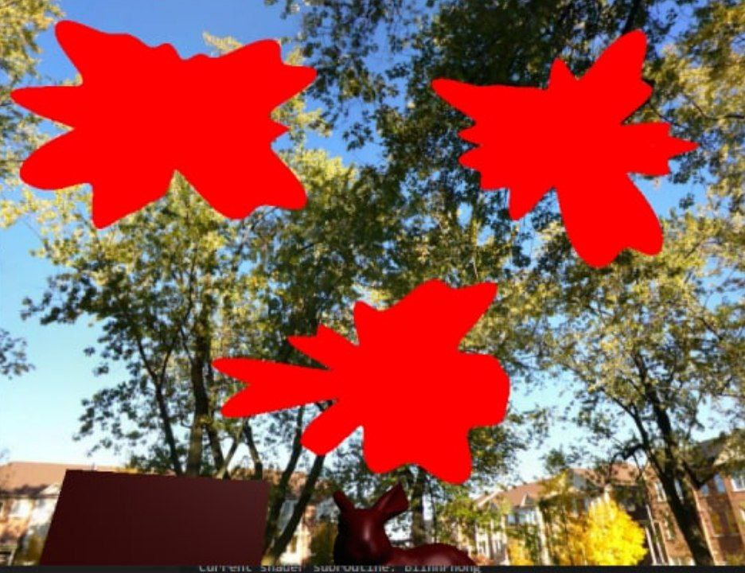

# RTGP-project
Project for the Real time graphics programming course, the goal of the project is to create a shaders tha add a blur when the player gets hit by a bullet; in paticoular a specific bullet might generate a blur in a random area of the FOV.  
when restoring the players health the effect might reduce over the time.  

## Random area and effect decreasing over time
the effect's area is generated using perlin noise and reduce its power over time.

## Limit the random area
i decided to bound the area ot the effect to the neighborhood of the collision point and to do so i've tried two approch: the fist one bounding the effect in a circular shape and a second, and final one, that adds a perlin noise loop to the circular shape  
### Circular shape
In the first I try to limit the area to a circular shape but the result didn't met the randomness criteria that i've set producing a not so random result

### Adding a noise to the circular shape
To have a more randomic shape I've decide to add an offeset to each point of the bounding are generated with a perlin noise. To avoid an abrupt end in the final point of the shape i've decided to use a perlin noise loop wich use a 2D noise instead of a one-dimensional noise and follow a circular path in the generated 2D space

## Multiple shoot in the same location
The application manages multiple shoot in the same location by simply increase the frequency of the perlin noise

## The blur
for the blur i've used a gaussian blur (but I'm planning to add other blur effects) generated in two pass (one vertical and one horizzontal) for effeciency reasons
### Horizontal blur

### Vertical blur

### Horizontal+Vertical blur

### A touch of color
since the blur effect is not always visible.

I've decided to add a touch of red to the impacted area.

## Commands
* **WASD**: Movement
* **SPACE**: shoot (from the turret to the player)
* **Mouse movement**: Look around

## Current state of the development

